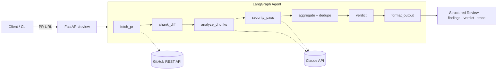
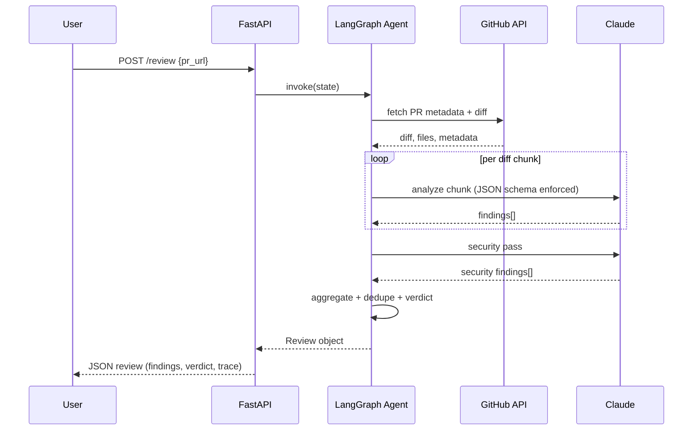

# Architecture

> *An AI code-review agent that shows its work — structured findings, real verdicts, measured accuracy.*

theReviewMan takes a GitHub PR URL and produces a structured, line-referenced review. The whole system is a single LangGraph pipeline fronted by a FastAPI endpoint. Every step is traceable, every model output is schema-enforced, and accuracy is measured — not assumed.

## Pipeline

`fetch_pr → chunk_diff → analyze_chunks → security_pass → aggregate → verdict → format_output`



### Node responsibilities

1. **fetch_pr** — resolve the PR URL to repo + number; pull metadata, changed files, and the unified diff via PyGithub.
2. **chunk_diff** — split the diff by file/hunk into model-sized chunks; preserve file paths and line numbers; handle very large PRs.
3. **analyze_chunks** — per-chunk LLM call returning **structured findings** (JSON-schema/tool-call enforced), never free prose.
4. **security_pass** — a dedicated pass with a security-focused prompt: injection, hardcoded secrets, broken auth, unsafe deserialization.
5. **aggregate** — merge findings across chunks, dedupe overlapping ones, sort by severity.
6. **verdict** — severity-weighted decision (any critical → request_changes, etc.) plus written reasoning.
7. **format_output** — assemble the final `Review` object with trace metadata.

## Request flow



## LangGraph state

The single state dict threaded through every node (lives in `src/reviewman/agent/state.py`):

```python
class AgentState(TypedDict):
    pr_url: str
    repo_full_name: str
    pr_number: int
    pr_meta: dict                     # title, author, base/head, files changed
    chunks: list["DiffChunk"]         # DiffChunk model lands Day 7
    chunk_findings: list[Finding]
    security_findings: list[Finding]
    findings: list[Finding]           # aggregated + deduped
    review: Review | None
    errors: list[str]
    trace: list[StepTrace]
```

## Data models

Implemented in `src/reviewman/models/review.py` — the contract every other component builds against:

```python
from enum import Enum

from pydantic import BaseModel, Field


class Category(str, Enum):
    bug = "bug"
    security = "security"
    quality = "quality"
    performance = "performance"


class Severity(str, Enum):
    critical = "critical"
    high = "high"
    medium = "medium"
    low = "low"


class Finding(BaseModel):
    category: Category
    severity: Severity
    file: str
    line_start: int
    line_end: int | None = None
    title: str
    explanation: str
    suggestion: str | None = None


class Verdict(str, Enum):
    approve = "approve"
    request_changes = "request_changes"
    comment = "comment"


class StepTrace(BaseModel):
    node: str
    model: str | None = None
    input_tokens: int = 0
    output_tokens: int = 0
    latency_ms: int = 0


class Review(BaseModel):
    pr_url: str
    summary: str
    findings: list[Finding] = Field(default_factory=list)
    verdict: Verdict
    verdict_reasoning: str
    trace: list[StepTrace] = Field(default_factory=list)
```

## Design principles

- **Structured output over prose.** Every LLM call returns schema-enforced JSON (tool-call enforced). Free-text reviews can't be aggregated, deduped, or measured — structured findings can.
- **Every review is traceable.** Each pipeline step records model, token counts, and latency in `StepTrace`. A review without receipts is just an opinion.
- **Evaluation is a first-class feature.** Precision/recall against human-labeled PRs ships with the project. Demos lie; evals don't.
- **Prompts are versioned in the repo like code.** Prompt changes go through the same review, diff, and history as everything else.
