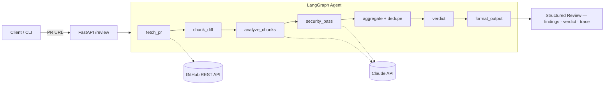

# theReviewMan

> *An AI code-review agent that shows its work — structured findings, real verdicts, measured accuracy.*


## The problem

PR reviews are slow, inconsistent, and miss security issues. Small teams feel it worst — everyone is busy shipping, so reviews get rushed, rubber-stamped, or skipped. Review quality shouldn't depend on who happens to be free that afternoon.

## What it does

Point theReviewMan at any GitHub pull request and it returns a structured, line-referenced review:

- **Findings** across four categories — bugs, security risks, code quality, performance — each tied to a specific file and line range, with an explanation and a suggested fix.
- **A verdict** — Approve / Request changes / Comment — with severity-weighted reasoning.
- **Receipts** — every review carries trace metadata (model, tokens, latency), and the project ships with an **evaluation suite** measuring precision/recall against human-labeled PRs.
- In its final form, it **posts the review as a comment directly on the PR**.

## Architecture at a glance



Full design — node responsibilities, agent state, data models, request flow — in [ARCHITECTURE.md](ARCHITECTURE.md).

## Tech stack

| Layer | Choice |
|---|---|
| Language | Python 3.12 |
| API | FastAPI + Uvicorn |
| Agent orchestration | LangGraph |
| LLM | Anthropic Claude via API (model name in config, default `claude-sonnet-4-6`) |
| GitHub integration | GitHub REST API via PyGithub |
| Data models | Pydantic v2 |
| Packaging | `uv` + `pyproject.toml` |
| Quality | pytest, ruff, mypy |

**On the roadmap:** Next.js + Tailwind demo UI on Vercel · Docker deploy · GitHub Actions CI · evaluation harness.

## Status

🚧 Day 1 of 50 — follow the [`roadmap`](ROADMAP.md).

## Follow the build

I'm posting every day of this build on LinkedIn → [MY-LINKEDIN-URL].

## Local setup

```bash
git clone https://github.com/vamsiduppala/theReviewMan.git
cd theReviewMan
uv sync
uv run pytest
```

That gets you the core data models and a green test suite. The runnable agent lands in Phase 2 — see the [roadmap](ROADMAP.md).

## License

[MIT](LICENSE)
